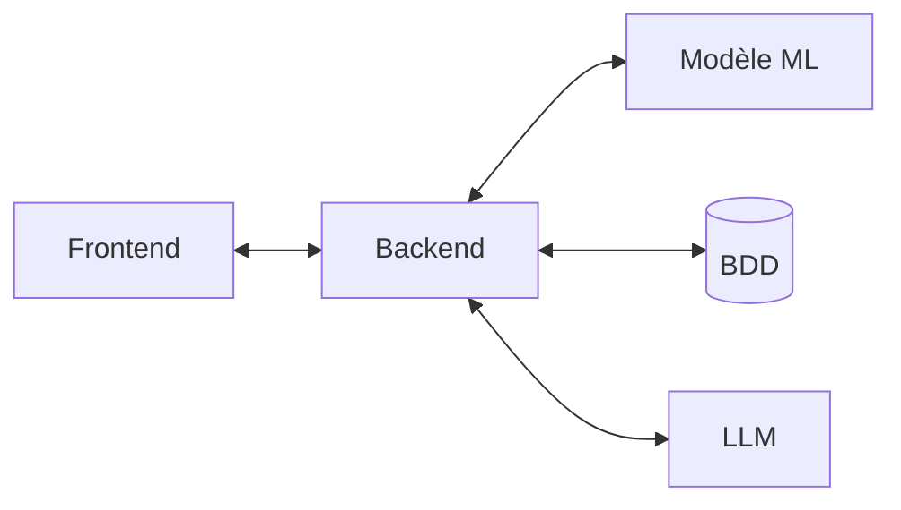

  

DriveWise

Compagnon mobile IA contre la fatigue au volant

Projet tutoré · 2025-2026

Hamitouche · Ouar · Tagnit Hammou · Bendjelili · Krattli

---
layout: default
---

# L'équipe

MOA, cadrage métier, besoins, recette

Yanis Hamitouche

Chef de projet

Abderrahim Ouar

Business analyst

MOE, architecture, code, ML, mobile

Myriem Tagnit Hammou

Développeuse backend

Nadjm Bendjelili

Développeur IA / ML

Raphael Krattli

Développeur frontend

---
layout: default
---

# Le partenaire

Sponsor terrain

Samir

Chauffeur de taxi

« Parfois je fais 10, 12 heures au volant. Au bout d'un moment, je sais plus si je suis encore en forme ou si je roule par habitude. J'aimerais juste qu'un truc me dise »

Du terrain à un produit

<strong>Extension aux chauffeurs professionnels</strong>

VTC indépendants
Flottes
Taxis
Livraison longue distance

Sponsor terrain → cible élargie pour un produit commercialisable.

---
layout: statement
class: text-center
---

La fatigue est la première cause d'accident chez les conducteurs professionnels.

Source : Sécurité Routière / ONISR, la somnolence est impliquée dans 1 accident mortel sur 3 sur autoroute.

---
layout: default
---

# Objectifs du projet

🎯

Prédire

Estimer un score de fatigue en temps réel à partir de signaux objectifs de conduite.

💡

Suggérer

Envoyer des conseils bienveillants, jamais autoritaires, au bon moment.

🔍

Expliquer

Rendre chaque prédiction lisible, pas une boîte noire.

🛡️

Respecter

Conformité RGPD, données conducteur, zéro surveillance patronale.

---
layout: default
---

# Fonctionnalités utilisateur

🚦

Démarrer un trajet

Un tap depuis le dashboard, permission GPS demandée une seule fois.

📊

Jauge de fatigue

Score 0 à 1 en continu, code couleur, niveau lisible.

💡

Conseils bienveillants

Messages courts en français, jamais autoritaires.

🔍

Comprendre le score

Facteurs qui augmentent ou réduisent la fatigue.

💬

Assistant conversationnel

Chatbot IA qui répond sur la fatigue et tes statistiques personnelles.

📈

Historique et stats

Tendance 7 jours, indicateurs globaux, liste des trajets.

🔔

Notifications

Rappels début et fin, mode discret, personnalisation.

🛡️

Vie privée

Consentement, export JSON, suppression, pauses manuelles.

⭐

Notation et feedback

Note des suggestions, contestation, feedback in-app.

Toutes les données restent sur le téléphone du conducteur, aucune information n'est partagée avec un employeur.

---
layout: default
---

# Périmetre technique

ÉTAPE 1

Capter

Le mobile envoie un snapshot GPS toutes les 30 s : vitesse, latitude, longitude, timestamp.

ÉTAPE 2

Agréger

Le backend calcule 10 features : durée du trajet, temps depuis la dernière pause, ratio de conduite, indicateurs circadiens.

ÉTAPE 3

Prédire

XGBoost prédit un score entre 0 et 1, mappé sur un niveau (faible, modéré, élevé, critique).

ÉTAPE 4

Expliquer

SHAP attribue à chaque feature sa contribution au score, top facteurs positifs et négatifs.

ÉTAPE 5

Conseiller

Si seuil franchi et cooldown 30 min respecté, Groq Llama 3.2 génère un message court, sinon fallback codé en dur.

Chaque snapshot déclenche cette boucle complète en quelques centaines de millisecondes. Tout vit dans une seule API FastAPI, le modèle XGBoost est chargé en mémoire au démarrage du serveur.

---
layout: default
---

# Assistant conversationnel

Un chatbot intégré à l'app qui répond aux questions du conducteur sur sa fatigue et ses statistiques personnelles.

🎯

Contexte personnalisé

Le profil du conducteur (5 derniers trajets, scores, pauses) est injecté dans le prompt. L'assistant cite ses vrais chiffres, n'en invente jamais.

📚

Base de connaissances

6 thèmes sur la fatigue (sommeil, pauses, rythme circadien, hydratation…) ancrent les réponses dans des conseils fiables.

🛡️

Garde-fous

Reste dans son domaine, jamais de diagnostic médical, ton bienveillant, mémoire glissante de 10 messages.

Groq · Llama 3.3 70B · réponses en français, repli sur un message d'attente si le service est hors-ligne.

---
layout: default
---

# DriveWise, positionnement

CE QUE CE N'EST PAS

Un traceur GPS intrusif

Un outil de surveillance patronale

Un optimiseur de revenus

Une boîte noire opaque

CE QUE CE EST

Un compagnon de route bienveillant

Une prédiction sur signaux objectifs

Un conseiller suggestif, jamais autoritaire

Une IA explicable via SHAP

---
layout: default
---

# Architecture

---
layout: default
---

# Stack technologique

Mobile

React Native + Expo 54

Code unique iOS / Android / Web · Zustand · React Hook Form + Zod

Backend

FastAPI 0.115

Async · Pydantic v2 · OpenAPI auto · JWT + Bcrypt

ML

XGBoost 2.1

10 features tabulaires · entraînement &lt; 2 s

Explicabilité

SHAP 0.46

Contributions par prédiction · TreeExplainer

LLM

Groq · Llama 3.2 / 3.3

Suggestions (3.2) + assistant chatbot (3.3 70B) · fallback si offline

Données

SQLite + SQLAlchemy

Zéro config · suffisant pour le PoC

---
layout: default
---

# Pourquoi ces choix ?

<strong>XGBoost plutôt qu'un réseau de neurones</strong>

Sur données tabulaires &lt; 10k features, les arbres à gradient battent systématiquement le deep learning <em>(Grinsztajn et al., 2022)</em>. Modèle &lt; 1 Mo, inférence en ms.

<strong>SHAP plutôt que feature importance</strong>

Feature importance = classement global. SHAP = explication par prédiction. Indispensable pour la confiance du conducteur.

<strong>FastAPI plutôt que Flask</strong>

Validation auto via Pydantic, docs OpenAPI, async natif. Un seul langage Python pour API + ML.

<strong>React Native plutôt que Flutter</strong>

L'équipe maîtrise TypeScript, pas Dart. Code unique iOS + Android + Web via Expo.

---
layout: default
---

# Notifications et seuils

Un conseil utile n'est pas une notification de plus.

Le système applique trois règles :

<ul class="text-sm muted mt-2 space-y-1 list-disc pl-5">
<li>Délai minimum de 30 minutes entre deux suggestions</li>
<li>Notification immédiate en cas d'<strong>escalade</strong> de niveau</li>
<li><strong>Aucune</strong> suggestion en niveau faible</li>
</ul>

Faible

&lt; 0.3

Aucune suggestion.

Modéré

0.3 à 0.6

Notification in-app discrète.

Élevé

0.6 à 0.8

Notification push douce.

Critique

&gt; 0.8

Notification push forte, message court.

---
layout: default
---

# PoC sur données synthétiques

10 000

snapshots

500

conducteurs simulés

10

features modèle

&lt; 2 s

entraînement

<strong>Limite assumée du PoC</strong>

Données synthétiques (formule paramétrée + bruit gaussien). Elles permettent de valider l'architecture, la chaîne ML et l'UX, pas la performance en production.

<strong>Prochaine étape, données réelles</strong>

Des données de conduite professionnelle authentiques permettront de ré-entraîner le modèle et d'améliorer significativement la précision des prédictions.

---
layout: default
---

# Démonstration, parcours conducteur

Dashboard · démarrage du trajet

Trajet en cours · jauge de fatigue

Assistant conversationnel

---
layout: default
---

# Historique &amp; statistiques

Historique des trajets

Statistiques · tendance 7 jours

---
layout: default
---

# Tests utilisateurs

👥

QUI A TESTÉ ?

<ul class="text-sm mt-2 space-y-1 muted">
<li><strong style="color: var(--dw-ink);">Samir</strong>, chauffeur taxi, sponsor terrain</li>
<li>L'équipe en recette interne</li>
</ul>

🧪

COMMENT ?

<ul class="text-sm mt-2 space-y-1 muted">
<li>Cahier de recette sur <strong style="color: var(--dw-ink);">Notion</strong></li>
<li>Cas de test dérivés du Product Backlog</li>
<li>Sessions Expo Go sur Android physique</li>
<li>Statuts OK / KO / Bloqué / N/A</li>
</ul>

🎯

PÉRIMÈTRE COUVERT

Auth
RGPD
Cycle trajet
Score fatigue
Anti-harcèlement
Notifications
Historique
Hors-ligne

« Les conseils étaient trop fréquents en début de soirée. Avec le délai de 30 min ajouté, c'est nickel, ça reste utile sans devenir lourd. »

Samir, après la deuxième série de tests

---
layout: default
---

# Retours et ajustements

RETOUR TERRAIN

« Les messages étaient trop fréquents en début de soirée. »

AJUSTEMENT

Délai minimum de <strong>30 min</strong> entre deux suggestions + escalade prioritaire.

RETOUR TERRAIN

« Je veux comprendre pourquoi l'app dit que je suis fatigué. »

AJUSTEMENT

Ajout de l'écran <strong>détail SHAP</strong>, top contributeurs ↑/↓ par snapshot.

RETOUR TERRAIN

« Je veux pouvoir prendre une pause sans bouger. »

AJUSTEMENT

Bouton <strong>pause manuelle</strong> + mode discret pour les notifications.

---
layout: default
---

# Bilan, livré vs prévu

Sprint 1

Cadrage MOA + maquettes + dataset synthétique

Entretien partenaire, backlog, génération des 10k lignes.

✓ Livré

Sprint 2

Backend FastAPI + auth + cycle trajet

Endpoints, JWT, modèles SQLAlchemy, tests pytest.

✓ Livré

Sprint 3

ML XGBoost + SHAP + suggestions Groq

Entraînement, intégration, anti-harcèlement.

✓ Livré

Sprint 4

Mobile React Native, écrans clés

Auth, Dashboard, Trajet, Historique, Stats.

✓ Livré

Sprint 5

RGPD, notifications, assistant chatbot, refonte graphique, recette

Consentement, export, mode discret, assistant conversationnel, polish UI, cahier de recette.

● En cours

---
layout: default
---

# Difficultés et solutions

⚠️ Données de conduite peu accessibles

Les données de conduite réelles de chauffeurs professionnels sont rares, sensibles et soumises à des contraintes légales strictes.

→ Solution

Dataset synthétique de 10k lignes construit à partir de la littérature scientifique sur la fatigue au volant, permettant de valider l'architecture complète.

⚠️ Risque d'app intrusive

Une app de fatigue peut vite ressembler à un mouchard patronal.

→ Solution

Positionnement compagnon assumé dès le cadrage : aucune donnée tiers employeur, RGPD intégré au MVP.

⚠️ Coût LLM cloud

Génération de suggestions LLM = appel API payant à chaque snapshot.

→ Solution

Groq gratuit + fallback codé en dur + délai 30 min entre suggestions = volume divisé par ~20.

---
layout: default
---

# Perspectives

📦

Données réelles

Accès à des données de conduite professionnelle pour améliorer la précision du modèle.

🧠

Capteurs téléphone

Accéléromètre, gyroscope : à-coups, freinages, micro-déviations.

🌐

Backend cloud

Migration SQLite → PostgreSQL + déploiement Render / Fly.io.

👥

Mode flotte (opt-in)

Vue agrégée anonymisée pour gestionnaires VTC consentants.

⌚

Wear OS / watchOS

Compagnon montre, vibration discrète au seuil critique.

🏥

Partenariats santé

Médecins du travail, mutuelles, fédérations VTC.

---
layout: center
class: text-center
---

Merci

Questions ?

DriveWise · Projet tutoré · 2025-2026

Hamitouche · Ouar · Tagnit Hammou · Bendjelili · Krattli

